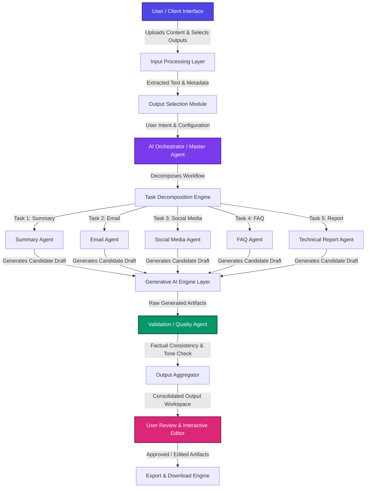

# TransformAI — An Agentic Multi-Format Content Transformation Engine

> **Transforming complex, heterogeneous source documents into tailored, audience-specific communication artifacts using Human-in-the-Loop Agentic AI.**

[](#system-architecture)
[](#why-agentic-ai)
[](#technology-stack)
[](#license)

---

## 📌 Table of Contents
- [Overview](#overview)
- [Problem Statement](#problem-statement)
- [Our Solution](#our-solution)
- [Why Agentic AI?](#why-agentic-ai)
- [Generative AI vs. Agentic AI](#generative-ai--agentic-ai)
- [Key Features](#key-features)
- [System Architecture](#system-architecture)
- [Workflow Walkthrough](#workflow)
- [Example Transformation](#example-transformation)
- [Specialized Agents](#specialized-agents)
- [Technology Stack](#technology-stack)
- [Project Structure](#project-structure)
- [Installation & Setup](#installation--setup)
- [Environment Variables](#environment-variables)
- [Internal Architecture & Orchestration](#how-it-works-internally)
- [Validation & Reliability](#validation--reliability)
- [Use Cases](#use-cases)
- [Comparative Advantages](#advantages)
- [Future Enhancements](#future-enhancements)
- [Security & Privacy](#security--privacy)
- [Demo & Screenshots](#demo--screenshots)
- [Team](#team)
- [SIH Context](#sih-context)
- [License](#license)

---

## 📖 Overview

**TransformAI** is an intelligent, agent-driven content transformation platform designed to solve the challenge of information fragmentation in modern organizations. When critical information exists in long-form or complex formats—such as threat intelligence advisories, research papers, policy documents, news reports, and incident logs—organizations struggle to rapidly adapt this information for different stakeholders and media channels.

TransformAI empowers users to upload complex source material and select a suite of distinct target outputs (e.g., Executive Summaries, Social Media Posts, Employee Awareness Emails, FAQs, and Technical Reports). Powered by a **Master AI Orchestrator** and a suite of **Specialized Domain Agents**, TransformAI intelligently decomposes the transformation task, executes content generation in parallel, validates outputs for factual fidelity, and presents ready-to-use artifacts for human approval.

> [!IMPORTANT]
> **Human-in-the-Loop Design Principle:** TransformAI is explicitly built as an **assisted, human-in-the-loop platform**, not an unmonitored autonomous system. The user retains complete authority over *what* outputs are required and *approves/edits* all generated content before export.

---

## 🚨 Problem Statement

In today's fast-paced environment, organizations digest vast quantities of information across diverse formats:
- Technical incident reports & advisories
- Policy updates & compliance standards
- Academic papers & technical whitepapers
- Press announcements & market news
- Unstructured free-form prompts and briefs

Converting a single 15-page technical report into actionable communications—such as an executive summary for C-suite leaders, an awareness email for employees, a LinkedIn post for public relations, and an operational FAQ for IT teams—is a **manual, repetitive, and labor-intensive task**.

### Key Challenges of Traditional Methods:
1. **High Latency:** Manual reading, synthesis, and re-drafting consume hours or days.
2. **Inconsistent Messaging:** Different teams drafting separate communications often introduce conflicting details or alter key facts.
3. **Tone Misalignment:** Adapting technical jargon into accessible language for non-technical stakeholders requires specialized editing skills.
4. **Scalability Bottlenecks:** Human teams cannot keep pace during crisis events or high-volume publishing schedules.

---

## 💡 Our Solution

TransformAI bridges the gap between raw information and audience-tailored distribution through a structured **Human-in-the-Loop Agentic Engine**:

```
User Intent (Selects Inputs & Targets)
                  │
                  ▼
       AI Orchestrator (Decomposes Tasks)
                  │
                  ▼
    Specialized Agents (Parallel Generation)
                  │
                  ▼
      Validation Agent (Factual & Tone Audit)
                  │
                  ▼
        User Review & Export (Final Human Approval)
```

1. **Flexible Ingestion:** Upload PDF, DOCX, TXT, web URLs, articles, or raw text prompts.
2. **Explicit Target Selection:** Select exact output formats tailored to your target audiences.
3. **Automated Task Decomposition:** An AI Orchestrator analyzes the source document structure and breaks down generation tasks into isolated micro-tasks.
4. **Specialized Agent Execution:** Domain-trained agent prompts independently construct each artifact according to format-specific constraints.
5. **Quality & Grounding Audit:** A dedicated Validation Agent checks all outputs against the source text to minimize hallucinations and enforce cross-output consistency.
6. **Human-in-the-Loop Control:** Users review, edit, refine, or regenerate individual outputs before exporting in desired formats.

---

## 🤖 Why Agentic AI?

Traditional Large Language Model (LLM) implementations rely on **single-prompt workflows**, asking a single LLM call to produce multiple distinct artifacts simultaneously. This approach exhibits fundamental weaknesses:
- **Context Degradation:** LLMs struggle to maintain strict formatting rules across multiple outputs in one response window.
- **Tone Bleed:** Technical tone leaks into public awareness posts, or casual tone degrades executive summaries.
- **Lack of Verification:** A single LLM cannot critique its own output within the same execution path effectively.

### The Agentic Advantage in TransformAI:

- **Task Decomposition:** The Master Orchestrator treats complex user requests as a execution graph rather than a single prompt string.
- **Specialized Roles:** Each agent operates with distinct system instructions, constraints, formatting schemas, and audience models.
- **Parallel Processing:** Independent tasks (e.g., drafting a LinkedIn post vs. building an internal FAQ) run concurrently, reducing processing latency.
- **Dedicated Quality Assurance:** Decoupling validation into a secondary agent step ensures impartial factual verification against source content.
- **Human-in-the-Loop Governance:** Orchestrators provide deterministic control structures so humans can step in at any stage.

---

## ⚡ Generative AI vs. Agentic AI

TransformAI distinctively combines both **Generative AI** and **Agentic AI**:

| Dimension | Generative AI Layer | Agentic AI Layer |
| :--- | :--- | :--- |
| **Primary Function** | Content Synthesis & Text Generation | Workflow Orchestration & Control |
| **Role in Platform** | Produces natural language text, summaries, and translations. | Decomposes goals, routes tasks, selects tools, and validates results. |
| **Execution** | Executes single inferencing calls based on provided context. | Coordinates multi-agent parallel execution graphs and state tracking. |
| **Quality Control** | Generates candidate responses. | Audits outputs for factual grounding, tone compliance, and completeness. |

---

## ✨ Key Features

- **📄 Multi-Format Input Support:** Ingest PDFs, Word Documents (`.doc`/`.docx`), Plain Text, Web URLs, News Articles, Advisories, and Free-Form Prompts.
- **🎯 User-Defined Target Selection:** Multi-select desired output artifacts from an intuitive control panel.
- **🧠 Intelligent Document Parsing:** Extract clean text, structure, tables, and metadata prior to LLM processing.
- **🧩 Master Agent Orchestration:** Dynamically break down complex requests into isolated, parallelizable sub-tasks.
- **🤖 Specialized Micro-Agents:** Domain-specific generation for Summaries, Emails, Social Media, FAQs, Reports, Presentations, and Translations.
- **⚡ Parallel Task Execution:** Process multiple output formats concurrently to optimize runtime performance.
- **🎯 Audience & Tone Adaptation:** Automatically adapt readability, length, jargon level, and formatting for specific demographics.
- **🛡️ Factual Grounding & Hallucination Auditing:** Automated cross-checking against source materials to preserve factual integrity.
- **✏️ Interactive Human-in-the-Loop Editor:** Review, edit, refine, or regenerate individual output cards on demand.
- **💾 Export Flexibility:** Download generated artifacts as Markdown, PDF, HTML, or copy directly to clipboard.

---

## 🏗️ System Architecture

The following Mermaid diagram illustrates the end-to-end data flow and agent coordination within TransformAI:



---

## 🔄 Workflow Walkthrough

Here is how TransformAI processes a complex real-world request step-by-step:

### Step 1: Input Ingestion
The user uploads a 10-page **Cybersecurity Incident Report** regarding a critical zero-day vulnerability.

### Step 2: Output Selection
The user checks the following target artifacts:
- [x] **Executive Summary** (For C-Suite / Board)
- [x] **Employee Awareness Email** (For Internal Staff)
- [x] **LinkedIn Post** (For External PR)
- [x] **Operational FAQ** (For IT & Support Teams)

### Step 3: Orchestration & Decomposition
The **AI Orchestrator** parses the 10-page document, identifies key entities (CVE IDs, impact, remediation steps, timelines), and creates 4 independent execution tasks:
1. `Task_01` → Assign to `Summary Agent` (Target tone: Formal, concise, strategic)
2. `Task_02` → Assign to `Email Agent` (Target tone: Actionable, reassuring, urgent)
3. `Task_03` → Assign to `Social Media Agent` (Target tone: Professional, public-facing, concise)
4. `Task_04` → Assign to `FAQ Agent` (Target tone: Clear, question-answer structure, technical guidance)

### Step 4: Parallel Agent Execution
Tasks 1 through 4 execute in parallel via the Generative AI Layer, invoking specialized prompting strategies for each format.

### Step 5: Factual Validation Audit
The **Validation Agent** evaluates each generated candidate against the original 10-page report:
- *Check:* Does the Employee Email accurately reflect the mitigation steps without leaking unconfirmed speculation?
- *Check:* Does the Executive Summary match the financial/operational impact metrics stated in the report?

### Step 6: User Review & Export
The generated outputs are rendered in a multi-column dashboard where the user can fine-tune text, trigger single-card regenerations, and export all assets.

---

## 🔄 Example Transformation

```
┌─────────────────────────────────────────────────────────────────┐
│                    INPUT SOURCE DOCUMENT                        │
│ 10-Page Cybersecurity Incident Report (Vulnerability CVE-2024-X) │
└─────────────────────────────────────────────────────────────────┘
                                │
                                ▼
         ┌──────────────────────────────────────────────┐
         │     TRANSFORMAI MULTI-AGENT TRANSFORMATION   │
         └──────────────────────────────────────────────┘
                                │
   ┌────────────────────┬───────┴────────────┬────────────────────┐
   ▼                    ▼                    ▼                    ▼
┌──────────────────┐ ┌──────────────────┐ ┌──────────────────┐ ┌──────────────────┐
│Executive Summary │ │  Employee Email  │ │  LinkedIn Post   │ │   Internal FAQ   │
├──────────────────┤ ├──────────────────┤ ├──────────────────┤ ├──────────────────┤
│High-level overview│ │Immediate action  │ │Public statement  │ │Q&A for IT helpdesk│
│of breach scope,  │ │items for staff,  │ │regarding patch   │ │addressing patch  │
│business risk, and│ │phishing alert, & │ │deployment and    │ │procedures & user │
│budget allocation.│ │password updates. │ │system security.  │ │system impact.    │
└──────────────────┘ └──────────────────┘ └──────────────────┘ └──────────────────┘
```

> [!NOTE]
> All outputs remain strictly grounded in the source text. Non-sourced claims or extraneous hallucinations are flagged and excised by the Validation Agent.

---

## 🤖 Specialized Agents

TransformAI uses specialized agents designed for distinct document targets:

| Agent Name | Core Responsibility | Typical Output Format | Target Audience |
| :--- | :--- | :--- | :--- |
| **Document Analysis Agent** | Parses, cleanses, and extracts structured key entities from source documents. | JSON Knowledge Graph / Key Points | Internal Orchestration Layer |
| **Summarization Agent** | Synthesizes complex source text into executive & detailed summaries. | Markdown Bullet Points & Highlights | C-Suite, Executives, Managers |
| **Email Generation Agent** | Drafts audience-aligned emails (internal announcements, alerts, newsletters). | Subject Line + Email Body | Internal Employees, Clients |
| **Social Media Agent** | Crafts engaging short-form social posts with hashtags & key takeaways. | LinkedIn / Twitter / Meta posts | Public, Followers, Tech Community |
| **FAQ Agent** | Converts analytical content into intuitive Question-and-Answer pairs. | Categorized Q&A Lists | Support Desks, Users, Customers |
| **Technical Report Agent** | Expands key facts into structured technical summaries or whitepaper snippets. | Formatted Technical Documentation | Engineers, IT Operations |
| **Presentation Agent** | Converts source points into slide-by-slide titles and speaker notes. | Slide Deck Outline (Markdown/JSON) | Presenters, Stakeholders |
| **Translation Agent** | Translates output artifacts into target languages while preserving context. | Multilingual Document Text | Global Teams, Regional Public |
| **Validation Agent** | Cross-audits generated outputs against source text for factual grounding. | Validation Report / Quality Score | Internal Orchestration Layer |

---

## 💻 Technology Stack

> [!NOTE]
> **Project Configuration Status:** The repository infrastructure is currently initialized. Technology configurations below represent the foundational setup planned for full component integration.

- **Frontend Interface:** *To be configured* (Recommended: HTML5 / Modern Vanilla JS or React framework)
- **Backend Service:** *To be configured* (Recommended: Python FastAPI / Node.js Express)
- **Agent Orchestration Framework:** *To be configured* (Recommended: LangChain / LangGraph / Custom Python Orchestrator)
- **Generative AI Models:** *To be configured* (Integrates via OpenAI API / Google Gemini API / Anthropic Claude API / Ollama local models)
- **Document Processing:** *To be configured* (PyPDF / pdfplumber / python-docx / BeautifulSoup4)
- **Database / Cache:** *To be configured* (Redis for task states / PostgreSQL or SQLite for audit history)

---

## 📁 Project Structure

```text
TranformAi/
├── README.md                 # Project Overview & Technical Documentation
├── docs/                     # Documentation & Architecture Assets
│   └── screenshots/          # Application Screenshots (Placeholders)
└── (Codebase modules under active configuration)
```

---

## 🧠 How It Works Internally

TransformAI uses a deterministic step-by-step pipeline to process each request:

```text
Input Document 
  └─► Parsing & Text Extraction 
        └─► Structure Analysis & Entity Extraction 
              └─► User Intent & Target Output Map 
                    └─► AI Orchestrator Task Graph Construction 
                          └─► Parallel Dispatch to Specialized Agents 
                                └─► GenAI Content Generation 
                                      └─► Validation Agent Factual Audit 
                                            └─► Aggregation & Presentation 
                                                  └─► Human Review & Edits 
                                                        └─► Multi-Format Export
```

1. **Document Ingestion & Parsing:** Extracts raw text, headers, and metadata while stripping formatting noise.
2. **Intent Mapping:** Maps user-selected output tags to specific Agent Configuration Schemas.
3. **Graph Construction:** The Orchestrator constructs an acyclic task graph, pairing independent tasks for parallel processing.
4. **Agent Execution:** Specialized prompt templates pass document context and target formatting parameters to the GenAI layer.
5. **Validation Audit:** A verification prompt compares candidate outputs line-by-line with the parsed source text.
6. **User Workbench:** The frontend renders editable artifact cards allowing real-time modification or single-click regeneration.

---

## 🎼 Agent Orchestration & Parallelism

The **Master Orchestrator Agent** manages execution order and state across all sub-agents:

- **Dependency Graph Analysis:** Tasks with no inter-dependencies (e.g., generating an Email vs. generating a Social Media post) are flagged for **concurrent execution**.
- **Context Allocation:** Rather than sending entire 50-page documents to every agent, the Orchestrator feeds relevant document slices and key entity summaries to targeted micro-agents, optimizing token usage and latency.
- **State Management:** Tracks progress (Pending, Processing, Validating, Completed, Failed) for each artifact in real time.

---

## 🛡️ Validation & Reliability

Ensuring high factual accuracy is critical when transforming sensitive organizational documents.

> [!WARNING]
> While TransformAI employs multi-stage verification to dramatically reduce hallucinations, no LLM system can guarantee 100% elimination of errors. Human-in-the-loop review remains essential.

### Validation Agent Safeguards:
- **Grounding Verification:** Verifies that all facts, numbers, dates, and names in generated outputs exist in the source document.
- **Omission Detection:** Checks if critical safety instructions or disclaimers were omitted during summarization.
- **Format Adherence:** Ensures emails contain subject lines, FAQs maintain Q&A pairs, and social posts follow length restrictions.
- **Tone & Audience Check:** Audits vocabulary complexity and reading levels to match the specified target demographic.

---

## 🎯 Use Cases

- **🔒 Cybersecurity Advisories:** Convert technical incident reports into executive briefings, employee alerts, and public statements.
- **🏛️ Government & Public Advisories:** Translate complex policy whitepapers into accessible public notices and FAQs.
- **🏢 Corporate Communications:** Transform internal strategy memos into departmental updates, newsletter snippets, and presentation slides.
- **🎓 Research Paper Adaptation:** Convert academic papers into digestible blog posts, executive summaries, and slide outlines.
- **📢 Press & Media Relations:** Turn product release documentation into targeted press releases and social media campaigns.
- **⚖️ Policy & Compliance Updates:** Convert legal/regulatory updates into actionable compliance checklists for staff.

---

## ⚖️ Comparative Advantages

| Feature / Metric | Manual Human Creation | Single-Prompt LLM Workflow | TransformAI Agentic Engine |
| :--- | :--- | :--- | :--- |
| **Processing Speed** | Hours to Days | Seconds (Single Output) | Fast Parallel Execution (Minutes) |
| **Multi-Format Adaptation** | Labor-intensive, repetitive | High risk of formatting errors | Specialized micro-agents per format |
| **Factual Consistency** | Subject to human fatigue | Frequent hallucination & leakage | Automated Validation Agent audit |
| **Tone Precision** | Varies by individual writer | Inconsistent across outputs | Strictly constrained domain prompts |
| **Human Control** | High | Low (Take-it-or-leave-it output) | **Full Human-in-the-Loop Governance** |

---

## 🚀 Future Enhancements

- [ ] **Enterprise RAG Integration:** Connect to internal vector databases (Pinecone, ChromaDB, Qdrant) for contextual background retrieval.
- [ ] **Expanded Multi-lingual Support:** Real-time translation into 50+ global languages with localized tone adaptation.
- [ ] **Voice Input & Podcast Synthesizer:** Convert written documents into conversational audio scripts and podcasts.
- [ ] **Advanced Graph Fact-Verification:** Knowledge-graph extraction for mathematical and statistical validation.
- [ ] **Custom Agent Builder:** Drag-and-drop studio to define custom output agents and template prompts.
- [ ] **Enterprise Workflow Integration:** Direct export connectors to Slack, Microsoft Teams, Mailchimp, and LinkedIn APIs.

---

## 🔐 Security & Privacy

TransformAI is designed with data privacy in mind:

- **Local Execution Compatible:** Architecture supports local model backends (via Ollama / LM Studio) for strict air-gapped security.
- **Zero Third-Party Training (Planned):** Enterprise API integrations enforce zero data-retention policies.
- **Stateless Document Processing:** Uploaded files are processed transiently in memory and cleared upon session termination.

---

## 🖼️ Demo & Screenshots

*(Placeholder sections for application UI screenshots)*

| Output Selection Dashboard | Multi-Agent Execution Progress |
| :---: | :---: |
|  |  |

| Interactive Review & Editor | Export Options |
| :---: | :---: |
|  |  |

---

<p align="center">
  <i>Built with passion for intelligent, human-centric AI workflows.</i>
</p>
