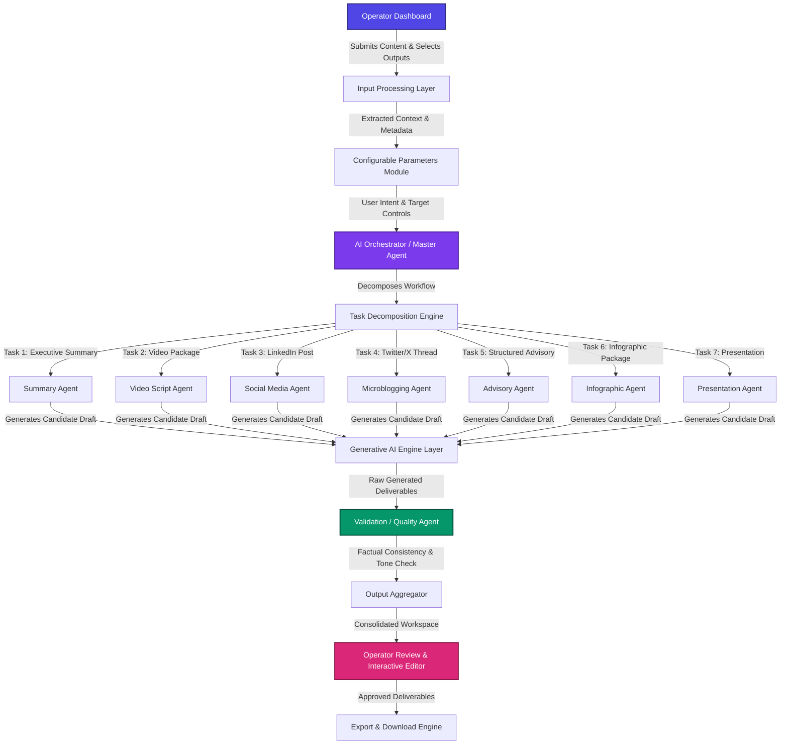

# TransformAI — An Agentic Multi-Format Content Transformation Engine

> **Transforming complex, heterogeneous source documents into tailored, audience-specific communication artifacts using Human-in-the-Loop Agentic AI.**

[](#system-architecture)
[](#why-agentic-ai)
[](#technology-stack)
[](#license)

---

## Overview

**TransformAI** is an intelligent, agent-driven content transformation platform designed to solve the challenge of information fragmentation in modern organizations. When critical information exists in long-form or complex formats—such as threat intelligence advisories, research papers, policy documents, news reports, announcements, incident logs, or free-form prompts—organizations struggle to rapidly adapt this information for different stakeholders and media channels.

TransformAI provides an operator dashboard through which users submit source content (English text, documents, articles, reports, prompts, images, videos, or contextual information) and explicitly configure desired target deliverables (such as Video Packages, LinkedIn Posts, Twitter/X Threads, Structured Advisories, Infographics, Executive Summaries, and Presentations). Powered by a **Master AI Orchestrator** and a suite of **Specialized Domain Agents**, TransformAI intelligently decomposes the transformation task, executes content generation in parallel, validates outputs for factual fidelity, and presents ready-to-use artifacts for human review and export.

> [!IMPORTANT]
> **Human-in-the-Loop Design Principle:** TransformAI is explicitly built as an **assisted, human-in-the-loop platform**, not an unmonitored autonomous system. The operator retains complete control over *what* outputs are requested and *approves/edits* all generated content before export.

---

## Problem Statement

Organizations frequently need to convert information available in different forms—such as news articles, reports, advisories, threat intelligence, policy documents, research papers, announcements, incident reports, or free-form prompts—into specific communication artifacts suitable for various audiences and purposes.

The traditional process requires manually analyzing source content, understanding the desired objective, and creating required output formats. This process is time-consuming, resource-intensive, and often requires specialized expertise across content creation, communication, and domain knowledge.

### Key Challenges Solved:
1. **High Latency:** Replaces manual reading, synthesis, and multi-format drafting with automated parallel generation.
2. **Inconsistent Messaging:** Eliminates conflicting statements when multiple teams draft separate communications from the same source.
3. **Tone and Style Bleed:** Ensures technical jargon is adapted into accessible language for general audiences while retaining technical precision for domain experts.
4. **Multi-Format Scalability:** Allows operators to select multiple output formats concurrently and generate all deliverables from a single source.

---

## Our Solution

TransformAI acts as an AI-powered content transformation engine that converts a common source of information into the specific deliverables requested by the operator, accelerating content creation and improving operational consistency.

```
Source Content Ingestion (Text, Docs, Articles, Videos, Prompts)
                           │
                           ▼
Operator Configurable Parameters (Audience, Tone, Detail, Style)
                           │
                           ▼
            AI Orchestrator (Decomposes Workflow)
                           │
                           ▼
       Specialized Agents (Parallel Task Execution)
                           │
                           ▼
         Validation Agent (Factual Grounding Audit)
                           │
                           ▼
        Operator Review Workbench (Edit, Regenerate, Export)
```

1. **Dashboard Content Submission:** Submit source content as raw text, uploaded documents (PDF/DOCX), articles, reports, prompts, or contextual data.
2. **Configurable Generation Parameters:** Control target audience, tone, language, level of detail, communication objective, and content style.
3. **Automated Task Decomposition:** The Master AI Orchestrator analyzes input context and builds an execution graph for sub-tasks.
4. **Specialized Agent Generation:** Domain agents generate format-specific deliverables in parallel.
5. **Factual Grounding Audit:** The Validation Agent verifies generated outputs against source text to eliminate unsupported claims and preserve accuracy.
6. **Operator Approval & Export:** Review, edit, regenerate, or download deliverables in Markdown, PDF, or text formats.

---

## Why Agentic AI?

Traditional Large Language Model (LLM) implementations rely on **single-prompt workflows**, asking a single LLM call to produce multiple distinct artifacts simultaneously. This approach exhibits fundamental weaknesses:
- **Context Degradation:** LLMs struggle to maintain strict formatting rules across multiple outputs in one response window.
- **Tone Bleed:** Technical tone leaks into public social posts, or casual tone degrades executive briefings.
- **Lack of Verification:** A single LLM cannot critique its own output within the same execution path effectively.

### The Agentic Advantage in TransformAI:

- **Task Decomposition:** The Master Orchestrator treats complex user requests as an execution graph rather than a single prompt string.
- **Specialized Roles:** Each agent operates with distinct system instructions, constraints, formatting schemas, and audience models.
- **Parallel Processing:** Independent tasks (e.g., generating a Video Package vs. building a Twitter Thread) run concurrently, reducing processing latency.
- **Dedicated Quality Assurance:** Decoupling validation into a secondary agent step ensures impartial factual verification against source content.
- **Human-in-the-Loop Governance:** Orchestrators provide deterministic control structures so operators can step in at any stage.

---

## Generative AI vs. Agentic AI

TransformAI distinctively combines both **Generative AI** and **Agentic AI**:

| Dimension | Generative AI Layer | Agentic AI Layer |
| :--- | :--- | :--- |
| **Primary Function** | Content Synthesis & Text Generation | Workflow Orchestration & Control |
| **Role in Platform** | Produces natural language text, scripts, and summaries. | Decomposes goals, routes tasks, selects tools, and validates results. |
| **Execution** | Executes single inferencing calls based on provided context. | Coordinates multi-agent parallel execution graphs and state tracking. |
| **Quality Control** | Generates candidate responses. | Audits outputs for factual grounding, tone compliance, and completeness. |

---

## Key Features

- **Multi-Format Source Ingestion:** Ingest text, documents (PDF/DOCX), articles, reports, advisories, research papers, and prompts.
- **Operator Dashboard Control:** Multi-select desired output deliverables through configurable dashboard parameters.
- **Configurable Parameters:** Tailor target audience, communication tone, level of detail, communication objective, and content style.
- **Master Agent Orchestration:** Dynamically break down complex requests into isolated, parallelizable sub-tasks.
- **Multi-Deliverable Generation:**
  - **Video Package:** Complete video script, scene-by-scene storyboard, narration text, subtitles, and visual recommendations.
  - **LinkedIn Post:** Platform-optimized professional posts suitable for publication.
  - **Twitter/X Post & Thread:** Character-optimized tweets and sequential tweet threads with hashtags.
  - **Structured Advisory:** Formal advisory documents detailing hazard levels, operational guidance, and compliance directives.
  - **Infographic Package:** Structured layout recommendations, key visual messaging, and graphic asset breakdown.
  - **Executive Summary:** Concise executive briefings highlighting key metrics and strategic decisions.
  - **Presentation Package:** Presentation slides outline, visual cues, and speaker notes.
- **Parallel Task Execution:** Process multiple output formats concurrently to optimize runtime performance.
- **Factual Grounding Audit:** Automated cross-checking against source materials to preserve factual integrity.
- **Interactive Operator Review:** Review, edit, refine, or regenerate individual output cards on demand.
- **Multi-Format Export:** Download generated artifacts as Markdown, PDF, or text.

---

## System Architecture

The following Mermaid diagram illustrates the end-to-end data flow and agent coordination within TransformAI:



---

## Workflow Walkthrough

Here is how TransformAI processes a complex real-world request step-by-step:

### Step 1: Input Ingestion
The operator submits a 10-page **Cybersecurity Incident Report** detailing a critical zero-day vulnerability (CVE-2024-38077).

### Step 2: Deliverable Selection & Parameter Configuration
The operator selects target deliverables on the dashboard:
- [x] **Executive Summary** (Target Audience: C-Suite)
- [x] **Video Package** (Target Audience: Media Production)
- [x] **LinkedIn Post** (Target Audience: Professional Public)
- [x] **Twitter/X Thread** (Target Audience: Microblogging Followers)
- [x] **Structured Advisory** (Target Audience: Infrastructure Engineers)
- [x] **Infographic Package** (Target Audience: Visual Media)
- [x] **Presentation** (Target Audience: Board Presenters)

### Step 3: Orchestration & Decomposition
The **AI Orchestrator** parses the input document, identifies key entities (CVE IDs, CVSS 9.8, affected services, remediation steps), and creates independent execution tasks assigned to specialized agents.

### Step 4: Parallel Agent Execution
Tasks execute concurrently via the Generative AI Layer, applying tailored prompts, constraints, and formatting rules for each deliverable type.

### Step 5: Factual Validation Audit
The **Validation Agent** evaluates each candidate deliverable against the source document to verify factual grounding, check for missing details, and confirm tone alignment.

### Step 6: Operator Review & Export
The generated deliverables are rendered in an interactive workbench where the operator can edit text, inspect grounding citations, regenerate individual cards, and export all files.

---

## Supported Output Deliverables

TransformAI supports specialized domain agents tailored for distinct communication outputs:

| Deliverable Type | Primary Focus | Generated Artifact Components | Target Audience |
| :--- | :--- | :--- | :--- |
| **Executive Summary** | Strategic Overview | High-level business impact, risk metrics, strategic decisions | C-Suite, Board, Executives |
| **Video Package** | Multimedia Production | Script, scene-by-scene storyboard, narration text, subtitles, visual cues | Video Editors, Media Teams |
| **LinkedIn Post** | Corporate PR & Engagement | Professional post text, key takeaways, call-to-actions, hashtags | Professional Community, PR |
| **Twitter/X Thread** | Short-Form Social | Sequential 5-tweet thread, character limits, engagement hooks | Microblogging Followers, Public |
| **Structured Advisory** | Operational Directive | Formal hazard summary, vulnerable scope, numbered action directives | IT Engineers, Compliance Staff |
| **Infographic Package** | Visual Data Representation | Layout wireframe recommendations, visual metric callouts, asset guide | Designers, General Public |
| **Presentation** | Stakeholder Briefing | Slide-by-slide titles, bullet points, visual cues, speaker notes | Presenters, Stakeholders |

---

## Technology Stack

> [!NOTE]
> **Project Configuration Status:** The repository infrastructure is currently initialized. Technology configurations below represent the foundational setup planned for full component integration.

- **Frontend Interface:** React 19 / Modern Vanilla CSS (Vite Engine)
- **Backend Service:** *To be configured* (Recommended: Python FastAPI / Node.js Express)
- **Agent Orchestration Framework:** *To be configured* (Recommended: LangChain / LangGraph / Custom Python Orchestrator)
- **Generative AI Models:** *To be configured* (Integrates via OpenAI API / Google Gemini API / Anthropic Claude API / Ollama local models)
- **Document Processing:** *To be configured* (PyPDF / pdfplumber / python-docx / BeautifulSoup4)
- **Database / Cache:** *To be configured* (Redis for task states / PostgreSQL or SQLite for audit history)

---

## Project Structure

```text
TranformAi/
├── README.md                 # Project Overview & Technical Documentation
├── index.html                # Web Application Entrypoint
├── package.json              # Project Dependencies & Vite Scripts
├── vite.config.js            # Vite Development Server Configuration
├── src/                      # React Source Code
│   ├── App.jsx               # Main Application Component & State Management
│   ├── index.css             # Glassmorphism Design System & Utility Tokens
│   ├── components/           # UI Components (Navbar, Hero, Input, Selector, Orchestrator, Workbench)
│   └── data/                 # Datasets, Sample Documents & Mock Pipeline Results
└── docs/                     # Documentation Assets
```

---

## How It Works Internally

TransformAI uses a deterministic step-by-step pipeline to process each request:

```text
Source Content 
  └─► Ingestion & Syntax Extraction 
        └─► Context & Entity Graph Construction 
              └─► Operator Dashboard Parameter Selection 
                    └─► AI Orchestrator Task Graph Decomposer 
                          └─► Concurrent Dispatch to Specialized Agents 
                                └─► GenAI Layer Execution 
                                      └─► Validation Agent Factual Audit 
                                            └─► Aggregation Workspace 
                                                  └─► Operator Review & Edits 
                                                        └─► Multi-Format Export
```

1. **Content Ingestion & Parsing:** Extracts raw text, headers, and metadata while stripping noise.
2. **Parameter Mapping:** Maps operator-selected target tags and tone controls to Agent Configuration Schemas.
3. **Graph Construction:** The Orchestrator constructs an acyclic task graph, pairing independent tasks for parallel processing.
4. **Agent Execution:** Specialized prompt templates pass document context and target formatting parameters to the GenAI layer.
5. **Validation Audit:** A verification prompt compares candidate outputs line-by-line with the parsed source text.
6. **Operator Workbench:** Renders editable artifact cards allowing real-time modification or single-click regeneration.

---

## Agent Orchestration & Parallelism

The **Master Orchestrator Agent** manages execution order and state across all sub-agents:

- **Dependency Graph Analysis:** Tasks with no inter-dependencies (e.g., generating a Video Package vs. generating a LinkedIn post) are flagged for **concurrent execution**.
- **Context Allocation:** Rather than sending entire 50-page documents to every agent, the Orchestrator feeds relevant document slices and key entity summaries to targeted micro-agents, optimizing token usage and latency.
- **State Management:** Tracks progress (Pending, Processing, Validating, Completed, Failed) for each deliverable in real time.

---

## Validation & Reliability

Ensuring high factual accuracy is critical when transforming sensitive organizational documents.

> [!WARNING]
> While TransformAI employs multi-stage verification to dramatically reduce hallucinations, no LLM system can guarantee 100% elimination of errors. Human-in-the-loop review remains essential.

### Validation Agent Safeguards:
- **Grounding Verification:** Verifies that all facts, numbers, dates, and names in generated outputs exist in the source document.
- **Omission Detection:** Checks if critical safety instructions or disclaimers were omitted during summarization.
- **Format Adherence:** Ensures video packages contain storyboards, advisories include severity levels, and tweets respect character limits.
- **Tone & Audience Check:** Audits vocabulary complexity and reading levels to match the specified target demographic.

---

## Use Cases

- **Cybersecurity Advisories:** Convert technical incident reports into executive briefings, video packages, employee alerts, and structured advisories.
- **Government & Public Health Advisories:** Translate complex policy whitepapers into public notices, FAQs, infographics, and news briefings.
- **Corporate Communications:** Transform internal strategy memos into departmental updates, LinkedIn posts, newsletter snippets, and presentation slides.
- **Research Paper Adaptation:** Convert academic papers into video summaries, tweet threads, digestible blog posts, and slide outlines.
- **Press & Media Relations:** Turn product release documentation into targeted press releases, social media campaigns, and infographics.
- **Policy & Compliance Updates:** Convert legal/regulatory updates into actionable compliance checklists and advisories.

---

## Comparative Advantages

| Feature / Metric | Manual Human Creation | Single-Prompt LLM Workflow | TransformAI Agentic Engine |
| :--- | :--- | :--- | :--- |
| **Processing Speed** | Hours to Days | Seconds (Single Output) | Fast Parallel Execution (Minutes) |
| **Multi-Format Adaptation** | Labor-intensive, repetitive | High risk of formatting errors | Specialized micro-agents per format |
| **Factual Consistency** | Subject to human fatigue | Frequent hallucination & leakage | Automated Validation Agent audit |
| **Tone Precision** | Varies by individual writer | Inconsistent across outputs | Strictly constrained domain prompts |
| **Human Control** | High | Low (Take-it-or-leave-it output) | **Full Human-in-the-Loop Governance** |

---

## Security & Privacy

TransformAI is designed with data privacy in mind:

- **Local Execution Compatible:** Architecture supports local model backends (via Ollama / LM Studio) for strict air-gapped security.
- **Zero Third-Party Training (Planned):** Enterprise API integrations enforce zero data-retention policies.
- **Stateless Document Processing:** Uploaded files are processed transiently in memory and cleared upon session termination.

---

## Smart India Hackathon (SIH) Context

TransformAI was conceptualized and architected to address Smart India Hackathon (SIH) problem themes focused on **AI-powered Multi-Format Content Transformation & Information Accessibility**. 

The system solves the critical need of public and private sector organizations to rapidly disseminate verified, multi-channel information from long-form technical, administrative, and emergency source documents.

---

## License

Licensing terms are **To Be Determined (TBD)** upon final repository publication.
